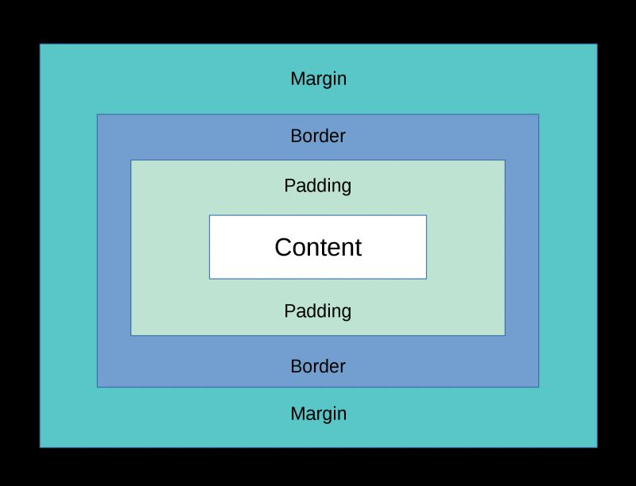

Link to site:
https://sherin-khaira-willspbpsiteorwhatever.pbp.cs.ui.ac.id/

TUGAS 5

1. Prioritas tinggi ke rendah
- inline styling (
style=""
)
- ID selector (#header { background-color: red;})
- class selector, psuedo class, attribute (:hover, :active)
- element selector, universal, psuedo element (div, p, ::before, ::after, *)

2. Karena memberikan pengguna pengalaman yang seamless. bayangkan kalau di screen hape, resolusinya tetap resolusi komputer. tentu tidak enak digunakan karena tombol cenderung terlalu kecil. Tidak hanya untuk website yang memiliki dua tampilan, responsive design juge dapat dilihat ketika sebuah window dikecilkan, atau menggunakan screen yang ukurannya lebih kecil atau lebih besar dari biasanya. Ini agar penggunaan website mudah dan tampaknya bersih dan konsisten

3. 
border - mengelilingi elemen, biasanya fungsinya visual, untuk dekorasi
padding - jarak konten di dalam elemen, agar tulisan atau elemen anak lebih jelas dan tidak menyentuh ujung dari elemen induknya
margin - space yang mengelilingi elemen, untuk memberi jarak antara elemen itu dengan elemen lain (selama posisi tidak absolut)

4. Flexbox adalah tipe yang digunakan kebanyakan industri (di banding absolute positioning dan relative positioning) karena potensi reactive-stylingnya, elemen flex akan secara automatis memenuhi screen tergantung settingan-nya, baik vertikal maupun horizontal. Grid-Layout adalah sebuah layout yang memiliki kolom dan baris, bisa untuk sebuah situs yang memiliki sejenis tabel yang menggunakan kolom dan baris untuk menampilkan konten.

5. Copy paste fungsi views dari tutorial dan meng-edit isinya agar berbeda, karena penggunaan template aken membuat proses development jauh lebih efisien. Penggunaan tools yang sudah dibuat dibandingkan menulis dari kosong sendiri adalah sesuatu yang semua developer harus pelajari.

----------------------------------------------------------

TUGAS 4
1.AuthenticationForm - form bawaan Django yang digunakan untuk proses login dari modul django.contrib.auth.forms. Menyediakan field standar seperti username dan password, serta melakukan validasi kredensial dengan sistem autentikasi Django.

2.Autentikasi -> Proses memverifikasi identitas pengguna. "Apakah kamu benar-benar orang yang kamu klaim?"
Otorisasi -> Proses memberi atau membatasi akses ke resource berdasarkan identitas pengguna yang sudah terverifikasi, misalnya pengguna yg bukan admin tidak boleh akses laman admin."Apa saja yang boleh kamu lakukan?"

3. 
Cookies
+ Disimpan di browser/client
+ Tidak perlu banyak storage di server
+ Bisa lintas request tanpa
- Bisa diubah client, harus divalidasi server
- Ukuran kurleb 4kb
- Bisa diblokir browser/hiland jika user clear  cache

Sessions
+ Disimpan di server, aman
+ Menyimpan data besar dan kompleks
- Membebani server
- Butuh cookie untuk menyimpan session ID (jadi tetap tergantung cookies, meski isinya bukan data sensitif)

4. Tidak sepenuhnya aman, ada beberapa risiko potensial seperti session hijacking, XSS attack, dan CSRF forgery. Django memberi pengaturan keamanan di settings.py, seperti SESSION_COOKIE_SECURE, SESSION_COOKIE_HTTPONLY, CSRF_COOKIE_SECURE, CSRF_COOKIE_HTTPONLY,django.middleware.csrf.CsrfViewMiddleware, dll.

5. Banyak copy paste dari Tutorial, tinggal diubah sesuai kebutuhan

----------------------------------------------------------

TUGAS 2
1. I followed most of the tutorial but found a /TemplateNotFound error which is fixed by adding 'main' to the INSTALLED_APPS variable within football_news/settings.py

2. Client Request -> urls.py (wills-pbp-site-or-whatever) -> (if valid endpoint) go to include('main.urls') -> urls.py (main)

3. A general configuration file. Most web frameworks have one. They contain settings for things like language, a base url for static files (img, videos, etc), production databases once you get to that, apps that are within this django project, etc. I honestly wish we used Next.JS instead, its so much more simple and fast, other than teaching the students how to use React which is a must in today's web development world.

4. Migrations is a feature so you can keep your database schema in tune with your python models. For example, a model Article gets a new attribute which is datePublished. The codebase will not detect this change until you scan it with python manage.py makemigrations and python manage.py migrate

5. Probably cause python is the "basic" learning language of early semesters, django also happens to be in python. If it wasn't, the other students who don't code outside of school would be left behind. Although i prefer javascript and typescript (because of many features such as autocomplete, linting, and keeping maintainability when the project goes very large). Python isn't the fastest programming language and Next.JS likely wins in simplicity and support, especially with the use of React and JSX/TSX.

6. Use NextJS :P